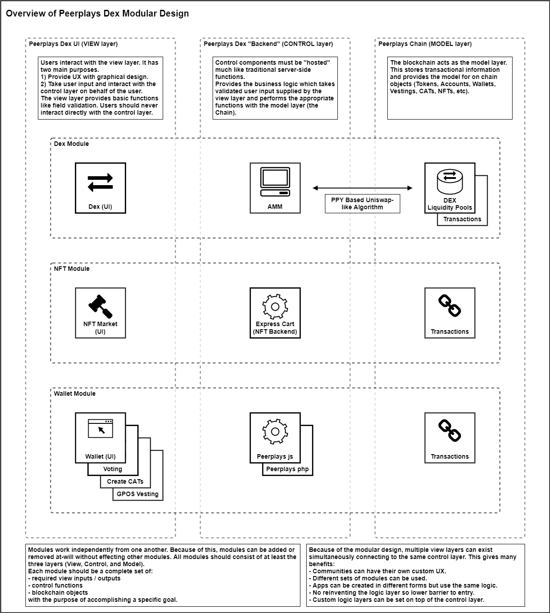
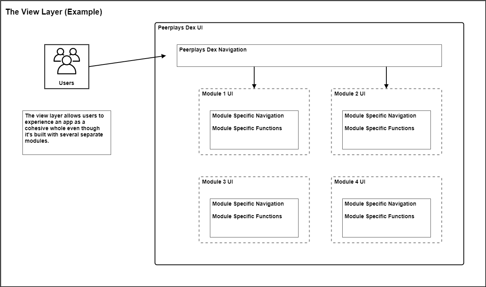
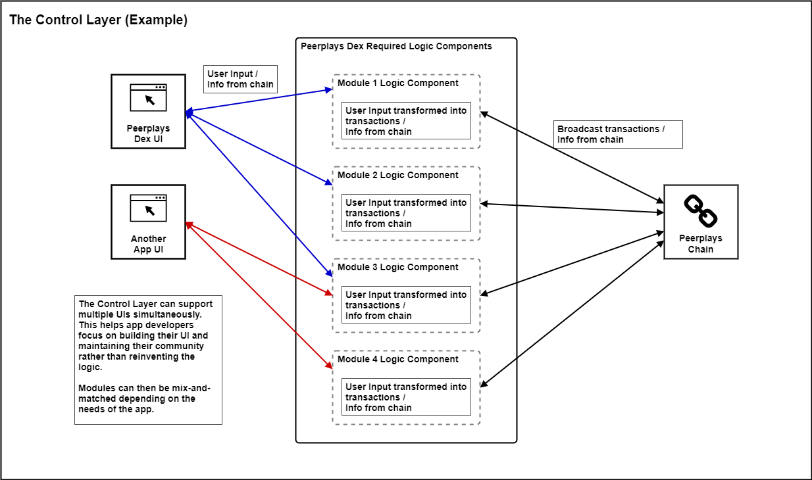
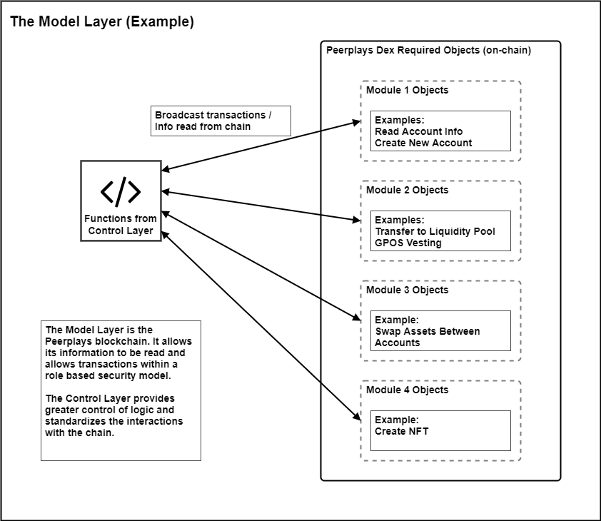
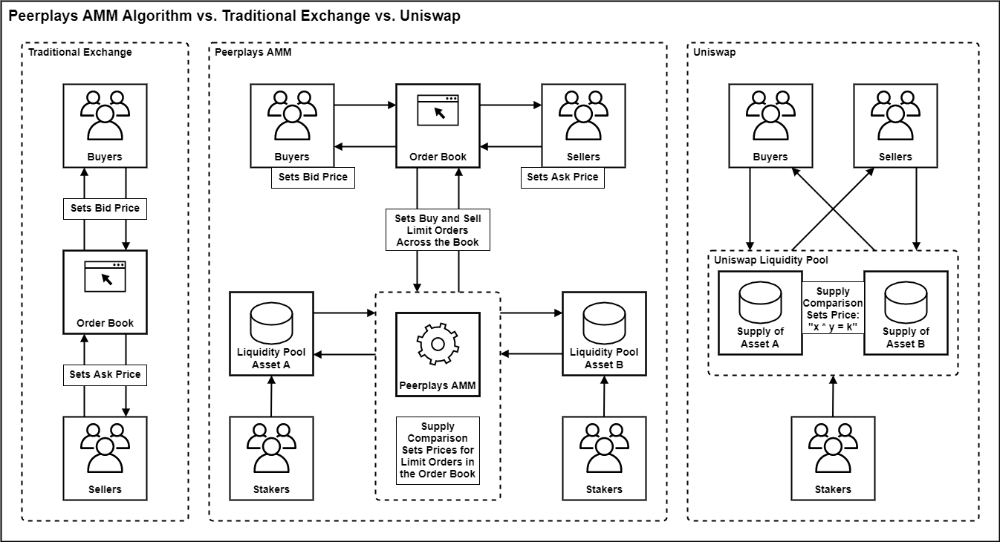

# Requirements Specification

## 1. Introduction

This requirements specification \(RS\) describes the high-level requirements for the initial release of the Peerplays Decentralized Exchange platform \(Dex\). This document is intended to be used by the members of the project team who will implement and verify the correct functioning of the system. Unless otherwise noted, all requirements specified here are committed for the initial release.

### 1.1. Purpose

The purpose of this RS is to cover the high-level outline and resulting requirements of the Dex. Lower level requirements documents for each component will be created.

### 1.2. Document Conventions

For the purpose of traceability, the following codes will be used in this RS:

| Code | Meaning |
| :--- | :--- |
| **OE-\#** | Operating Environment Requirement |
| **CO-\#** | Constraint |
| **DE-\#** | Dependency |
| **VL-\#** | View Layer Requirement |
| **CL-\#** | Control Layer Requirement |
| **ML-\#** | Model Layer Requirement |
| **DM-\#** | Dex Module Requirement |
| **NM-\#** | NFT Module Requirement |
| **WM-\#** | Wallet Module Requirement |

The keyword `shall` indicates a requirement statement.

### 1.3. Project Scope

The Dex will permit Peerplays users to:

* exchange Peerplays assets
* view, auction, buy, and sell NFTs
* use the following wallet functions
  * create an account
  * send / receive Peerplays assets
  * use GPOS vesting
  * governance voting \(witnesses, SONs, advisors\)
  * create CATs
  * view blockchain status

> **Peerplays assets** in the context of this RS are any on-chain asset. This includes native Peerplays assets like the PPY token, Peerplays NFTs, and CATs. This also includes assets that have originated off-chain that have been transferred onto the Peerplays chain through the services of Peerplays SONs. These external assets include Peerplays versions of BTC, HIVE, or ETH and even Peerplays versions of NFTs living on the Ethereum chain. The external assets are backed by their counterparts, locked in a Peerplays controlled account on their native chains.

## 2. Overall Description

### 2.1. Product Perspective

The new design for the Dex replaces the concept of building individual apps for each of Peerplays' core functions with a modular matrix. The matrix is built from layers which represent functional domains. The diagram below illustrates the view, control, and model layers. The various elements of the Peerplays ecosystem can be built to fit these layers. This ensures a well defined separation of concerns. This essentially splits UI/UX design from business logic and will allow for rapid development with low barrier to entry.

### 2.2. User Classes and Characteristics

| User class | Description |
| :--- | :--- |
| User | A user is an entity that accesses the Dex. A user with a Peerplays account has the intention of using the Dex to manage their account and Peerplays assets. A user without a Peerplays account has the intention of using the Dex to create a new account. A user \(with or without an account\) may also be interested in accessing the Dex to view information on the status of the blockchain, markets, etc. |

### 2.3. Operating Environment

**OE-1:** The Dex shall operate correctly with the following web browsers \(and platforms\):

| Browser | Platforms |
| :--- | :--- |
| Google Chrome | Ubuntu GNU Linux, Windows 10, Android, macOS, iOS |
| Firefox | Ubuntu GNU Linux, Windows 10, Android, macOS, iOS |
| Brave | Ubuntu GNU Linux, Windows 10, Android, macOS, iOS |
| Safari | macOS, iOS |

**OE-2:** The Dex shall operate correctly at the minimum resolution of 1334-by-750-pixel resolution at 326 ppi onward \(iPhone SE resolution\).

**OE-3:** The Dex shall permit user access from an internet connection.

**OE-4:** The Dex shall permit user access by desktop computer, Android, iOS, and Windows smartphones and tablets.

**OE-5:** The Dex shall operate on a server running Ubuntu version 18.04 or later.

> **OE-5.1:** In later versions of the Dex, the Dex shall operate as both a hosted version as per OE-5 and a stand-alone app \(i.e. Electron App\).

### 2.4. Design and Implementation Constraints

**CO-1:** All HTML code shall conform to the HTML 5.0 standard.

**CO-2:** Design elements shall maintain a standard look and feel by using Tailwind CSS and Tailwind UI components.

### 2.5. Assumptions and Dependencies

**DE-1:** The operation of the Dex depends on the Peerplays chain being operational.

**DE-2:** Successful transfers of assets on to and off of the Peerplays chain depends on having an operational sidechain for any given asset.

## 3. System Features

### 3.1. Layers

#### 3.1.1. View Layer

**Description**

The view layer of the Dex consists of the overall application's graphical design framework. This framework ties together the UIs of each module into one cohesive UX design. In this way the view layer can be described as both the individual module UIs and the wrapper that binds the modules into what a user would experience as a single app.

The view layer is responsible for information display, receiving and validating user input, managing input and output from the control layer, and app navigation.

The view layer interfaces with the control layer. Users never interact directly with the control layer. In a traditional web app, the view layer would be the client-side code.

**Requirements**

> The requirements below are for the overall Dex UI which contains the module specific UIs. See the sections relating to each specific module for requirements for their part of the view layer.

**VL-1:** The Dex view layer shall integrate module specific UIs to provide a consistent graphical design across all modules.

**VL-2:** The Dex view layer shall provide navigation for all integrated modules. Navigation must provide access to the following:

* top level home page
* login page \(wallet module\)
* account creation page \(wallet module\)
* Dex module dashboard page
* NFT module market page
* Wallet module dashboard page

**VL-3:** The Dex view layer shall be built with a responsive UI design.

**VL-4:** If an error occurs, the Dex view layer shall display meaningful error information to the user and provide them with actions they can take to attempt to resolve the error whenever possible.

#### 3.1.2. Control Layer

**Description**

The control layer of the Dex consists of the various business logic components required to take user input, transform that input as necessary, and perform actions in the model layer. The control layer also supplies the view layer with information from the model layer. The purpose of the control layer is to split away the business logic from the graphical design. This layer then acts more like a service that can support multiple apps simultaneously.

In a traditional web app, the control layer would be the server-side code \(excluding data storage\).

**Requirements**

**CL-1:** Components that comprise the Dex control layer shall not allow users to directly interact with them. These components can only integrate with the view layer and model layer. For example, users have to use the provided controls within the view layer to send information and commands to the components in the control layer.

#### 3.1.3. Model Layer

**Description**

The model layer of the Dex consists of the Peerplays blockchain and its objects.

In a traditional web app, the model layer would be the data storage and server-side object models.

**Requirements**

**ML-1:** The Dex model layer shall contain the objects and functions required by the components of the control layer.

### 3.2. Modules

#### 3.2.1. Dex Module

**Description**

The Dex facilitates the exchange of assets. It is important to Peerplays communities and blockchain governance because it allows the flow of PPY and CATs to accounts across the chain. The Dex is also necessary for rewards generation as the transaction fees are distributed to those who stake into the LPs. Given the modular design of the Dex components, DApps can use the Dex for easy asset exchange.

The Dex module handles all Decentralized Exchange related functions. This includes:

* trading pairs / markets
* the order book
* user order management
* user exchange account
* exchanging Peerplays assets using various order types
  * market orders
  * limit orders
    * good-til-canceled
    * good-til-time
    * fill-or-kill
    * immediate-or-cancel
    * maker-or-cancel
  * stop-limit orders
* quick send
* quick trade
* trade slippage protection
* Peerplays Automatic Market Maker \(AMM\)
* viewing and managing price charts
* viewing help documentation for the Dex module functions

> Lower level requirements specification documents will contain functional specifications for the above features.

**3.2.1.1. Peerplays Dex UI**

**Requirements**

**DM-1:** The Dex module view layer shall provide navigation to all Dex module features. Navigation must provide access to the following:

* user exchange account page
* Dex module settings
* Dex module pages

**DM-2:** The Dex module view layer shall allow user input in relevant form fields to perform the functions of the Dex module.

**DM-3:** The Dex module view layer shall perform input field validation and inform the user of acceptable form inputs.

**DM-4:** The Dex module view layer shall provide the user with help/hint text to explain available options and input fields.

**DM-5:** The Dex module view layer shall maintain a consistent graphical design with the other modules.

**DM-6:** The Dex module view layer shall provide the following pages which contain features as listed below:

* Exchange Dashboard
  * quick send
  * quick trade
  * user activity feed
  * user assets list
* Exchange
  * order books
  * buy / sell controls
  * user order history
  * user open orders
  * user asset balances display
  * market trade history
  * trading pairs / markets
  * price charts
  * price / volume statistics
* Asset Explorer
  * advanced asset search
  * asset info \(single asset page\)
* User Exchange Account
* Dex Module Settings
  * help documentation

**3.2.1.2. Automated Market Maker \(AMM\)**

**Description**

The AMM will utilize an algorithm which allows exchange and order book mechanics based on Uniswap-like technology. The AMM executes trades using the supply available within the liquidity pools.

A PPY based Uniswap-like algorithm will be necessary for the Dex to function. This will allow an exchange-like experience but also guarantees liquidity. This also makes PPY the basis of all trades and compliments Peerplays asset staking mechanisms.

Something like a hybrid between Uniswap and a traditional exchange order book, the AMM algorithm allows speculative trading of any trading pair. The prices are set on supply and demand principles. The diagram below illustrates the key differences between traditional trading, Uniswap, and the AMM algorithm.

In a traditional exchange, an order book is filled with the orders of buyers and sellers in a given market. Orders are filled when buyers are willing to pay what the sellers are asking for, or sellers are willing to take what buyers are bidding. Liquidity in this case is entirely dependant on the supply provided by the buyers and sellers.

In a Uniswap system, there are no order books. Instead, people stake assets into liquidity pools to earn rewards based on generated transaction fees. Buyers and sellers simply swap their assets at a price that preserves the liquidity within the underlying liquidity pools. Essentially, the greater the gap in supply between two assets, the higher the price will be for that trading pair. This creates an incentive to balance the supply in the liquidity pools.

Peerplays AMM combines the two systems to make an exchange system supported by staked liquidity pools. Order books are populated from the liquidity pools based on the difference between the available supplies of the assets in a given pair. Like in Uniswap, the higher the supply gap, the higher the price. The order book then takes orders from buyers and sellers with their limit prices. In this way, the pair of liquidity pools of the trading pair act as large market making buyers and sellers who are always willing to trade. As long as there are people willing to stake their assets to the liquidity pools, there will always be available liquidity for the exchange.

**Requirements**

**DM-7:** The AMM shall manage its own limit orders for each market \(trading pair\) based on LP supply comparison.

**DM-8:** The AMM shall interface with the model layer \(LPs\) to execute transactions.

**DM-9:** The AMM shall adjust all its positions based on changes in available supply in the LPs to preserve liquidity.

**3.2.1.3. Exchange Liquidity Pools \(LPs\)**

**Description**

The liquidity pools are special Peerplays controlled accounts that store staked assets for use in Dex trading. Users can stake assets to LPs to claim rewards based on exchange fees related to those assets.

**Requirements**

**DM-10:** The LPs shall store a supply of assets from stakeholders.

**DM-11:** The LPs shall allow assets to be staked and un-staked.

#### 3.2.2. NFT Module

**Description**

The NFT Market is intended to operate like an e-commerce marketplace website where users can buy, sell, and auction NFT assets.

The NFT module handles all NFT marketplace related functions. This includes:

* creating, viewing, and managing a user's NFTs
* buying NFTs
* selling NFTs
* buying NFTs at auction
* selling NFTs at auction
* searching and viewing other user's NFTs
* viewing help documentation for the NFT module functions

> Lower level requirements specification documents will contain functional specifications for the above features.

**3.2.2.1. NFT Market UI**

**Requirements**

**NM-1:** The NFT module view layer shall provide navigation to all NFT module features. Navigation must provide access to the following:

* user NFT account page
* NFT module settings
* NFT module pages

**NM-2:** The NFT module view layer shall allow user input in relevant form fields to perform the functions of the NFT module.

**NM-3:** The NFT module view layer shall perform input field validation and inform the user of acceptable form inputs.

**NM-4:** The NFT module view layer shall provide the user with help/hint text to explain available options and input fields.

**NM-5:** The NFT module view layer shall maintain a consistent graphical design with the other modules.

**NM-6:** The NFT module view layer shall provide the following pages which contain features as listed below:

* NFT Market
  * NFT advanced search
  * NFTs for sale
  * NFTs on auction
  * buy / sell / auction controls
  * prices / bids
* NFT Info \(single NFT page\)
  * trade / price history
  * NFT metadata display
  * NFT graphical display
  * buy / sell / auction controls
* NFT Maker
  * NFT templates
  * create NFT
  * market listing options \(sell / auction\)
* User NFT Account
  * user order history
  * user open auction bids
  * user asset balances display
  * user NFTs list
  * user activity feed
  * quick sell NFT
  * quick create NFT
* NFT Module Settings
  * help documentation

#### 3.2.3. Wallet Module

**Description**

The wallet is the main component with which users interact with the Peerplays chain. The wallet is the window to their account and asset information. It's also the foundation of account functions like logging in/out, sending/staking assets, governance, and viewing the status of the blockchain.

The wallet module handles all user account related functions. This includes:

* creating new accounts
* viewing and managing a user's account information
* viewing a user's asset balances
* sending and receiving assets
* voting functions
* vesting \(staking\) functions
* creating, viewing, and managing a user's NFTs
* searching and viewing other user's NFTs
* creating, viewing, and managing a user's CATs
* searching and viewing other user's CATs
* viewing the blockchain status information
* searching and viewing other user's public information
* viewing help documentation for user account functions
* user session management

> Lower level requirements specification documents will contain functional specifications for the above features.

**3.2.3.1. Wallet UI**

**Requirements**

**WM-1:** The Wallet module view layer shall provide navigation to all Wallet module features. Navigation must provide access to the following:

* login page
* Wallet module settings
* Wallet module pages

**WM-2:** The Wallet module view layer shall allow user input in relevant form fields to perform the functions of the Wallet module.

**WM-3:** The Wallet module view layer shall perform input field validation and inform the user of acceptable form inputs.

**WM-4:** The Wallet module view layer shall provide the user with help/hint text to explain available options and input fields.

**WM-5:** The Wallet module view layer shall maintain a consistent graphical design with the other modules.

**WM-6:** The Wallet module view layer shall provide the following pages which contain features as listed below:

* Wallet Dashboard
  * user assets list
  * user NFTs list
  * user activity feed
  * asset vesting \(staking, PowerUp/Down, etc.\)
  * rewards information
  * voting functions
  * asset send / receive
* notifications
* Network
  * blockchain status information
  * Peerplays account search
  * fee schedule
* NFT Manager
  * user NFTs list
  * NFT templates
  * create NFT
  * NFT Explorer
    * advanced NFT search
    * NFT Info \(single NFT page\)
* CAT Manager
  * user CATs list
  * CAT templates
  * create CAT
  * CAT distribution
  * CAT governance
  * CAT Explorer
    * advanced CAT search
    * CAT Info \(single CAT page\)
* Wallet Module Settings
  * asset claims
* help documentation
* New account creation
* Log in
* Log out

## 4. Appendix A: Glossary

| Term | Meaning |
| :--- | :--- |
| RS | Requirement Specification |
| Dex | Decentralized Exchange |
| NFT\(s\) | Non-Fungible Token\(s\) |
| GPOS | Gamified Proof of Stake |
| CAT\(s\) | Community Asset Token\(s\) |
| UI | User Interface |
| UX | User Experience |
| AMM | Automated Market Maker |
| LP\(s\) | Liquidity Pool\(s\) |

## 5. Appendix B: References



[Tailwind CSS](https://tailwindcss.com/)

