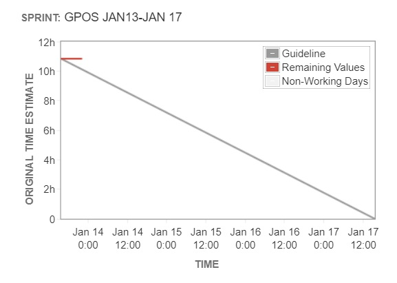

# GPOS

## GPOS Sprint Jan16-Jan30 

### ​**The Sprint goal** : Deliver fully functional GPOS enabled GPOS wallet to Public Testnet Beatrice 

**Expected deliverables:** PeerplaysJS-lib alpha and beta releases, Peerplays-GUI-Wallet beta release

There are 10 items in the backlog.

## Sprint Retrospect 

####  

&lt;Insert chart&gt;

#### **Progress** 

​

### QA Report 

Provide QA data, Zephyr charts

### Sprint Deliverables 

* peerplaysjs-lib link to release notes
* Peerplays-GUI-Wallet
* any other assets

​

