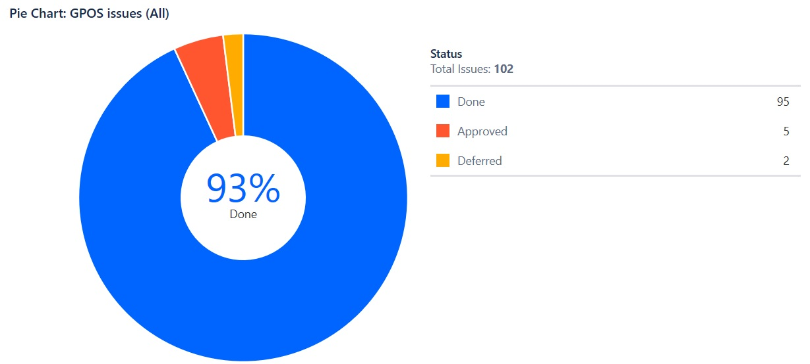
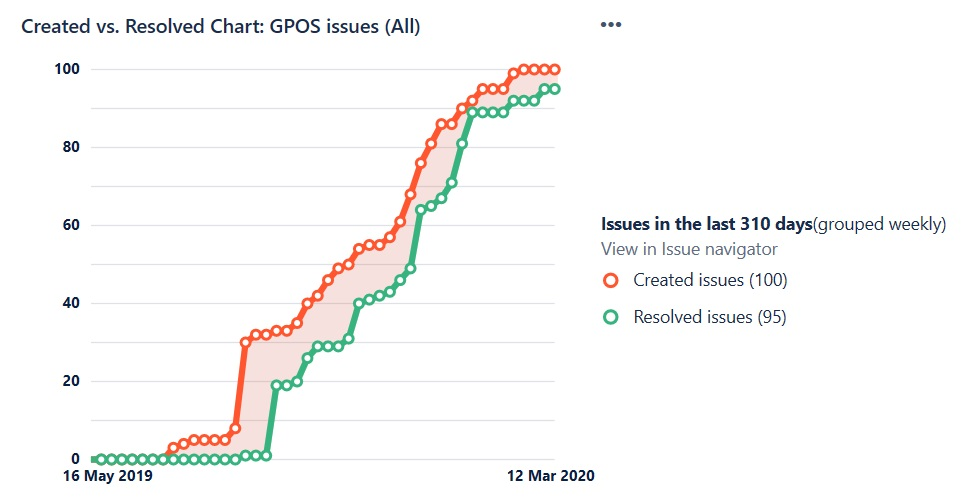

# GPOS

#### \*\*\*\* 

​

###  

###  

###  

### QA Report 

Provide QA data, Zephyr charts

### Sprint Deliverables 

* peerplaysjs-lib link to release notes
* Peerplays-GUI-Wallet
* any other assets

​

