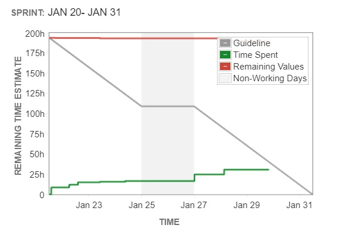
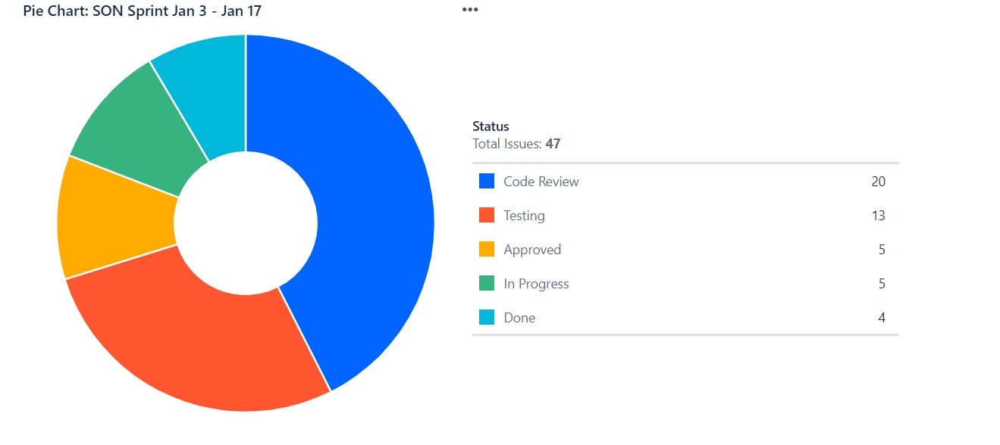
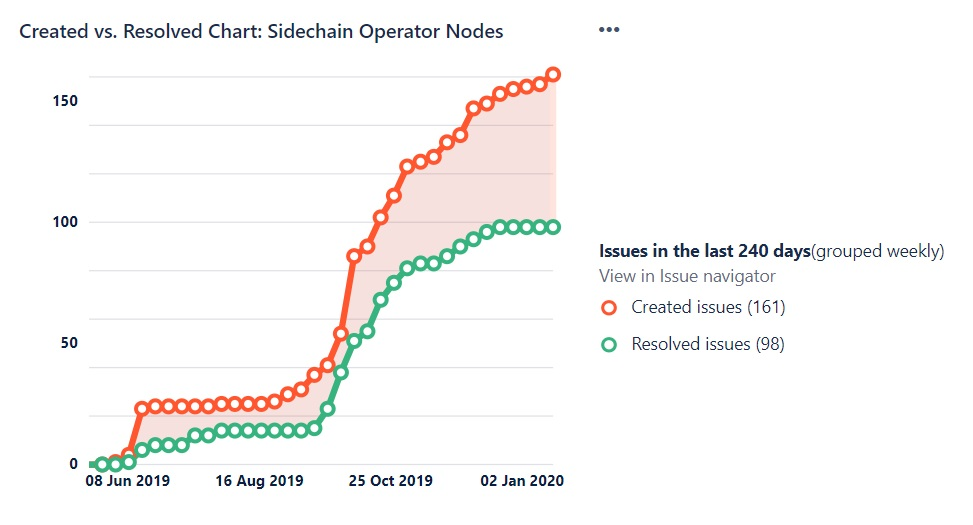

# SON

## SON Sprint Jan3-Jan17 \(in progress\) 

**The Sprint goal** : Deliver tasks in the sprint

**Expected deliverables:** SON heart beat, state changes

There are 33 items in the backlog

​

### QA Report 

Provide QA data, Zephyr charts

### Sprint Deliverables 

* [SON206 - Plugin SON Heartbeat changes](https://github.com/peerplays-network/peerplays/pull/250)
* [ SON194-SON195 - Report SON Down, addition of SON Account for sidechain consensus \#244](https://github.com/peerplays-network/peerplays/pull/244)

​

