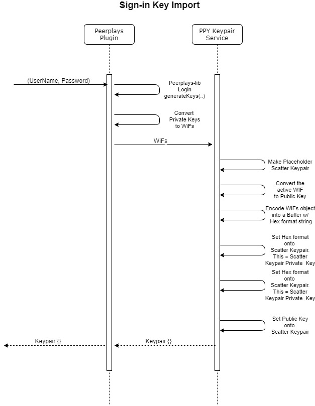
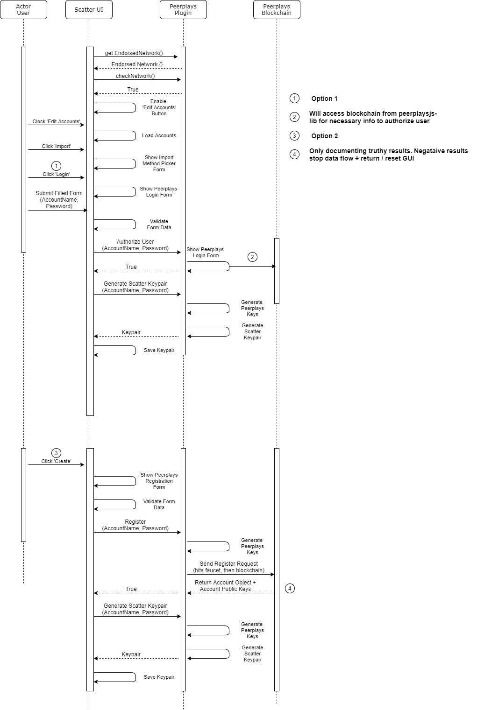

# Low Level

## Peerplays

### Account

A Peerplays account exists on the Peerplays blockchain and is registered via a faucet which handles requests from a dapp. There are some requirements that must be met when registering a new Peerplays account which can be seen [here](https://github.com/peerplays-network/peerplays/wiki/Account-Names).

### Keys

The Peerplays blockchain makes use of three keys to perform various actions: owner, active, and memo. Every account that is created on the Peerplays blockchain will have these keys generated from the account credentials they provide.

#### Owner

The owner key is the highest authority key for an account.

#### Active

The active key is the most used key of the three. This key is used to sign any transaction that is generated for a standard user account before being sent to the blockchain.

#### Memo

The memo key is used to encrypt messages sent with a balance transfer. Only the sender and the intended receiver can decrypt a memo. 

### Import

Most blockchains support account imports into other wallets or client application by having the end user account holder input their accounts private key into the client application. However, things are different for some blockchains, graphene blockchains like Peerplays.

To "import" an account on the Peerplays blockchain into a GUI dapp, the end user account holder simply has to input their accounts `name` and accounts password into a familiar login/register form. As mentioned in the [Account](https://app.gitbook.com/@peerplays/s/community-project-docs/scatter-peerplays-integration/design-specification/low-level#account) section above, these parameters have specific requirements.

Once an account owner has submitted their data and submitted the login/register form, the rest is behind the scenes in the code. The pseudo code below outlines the process:

```javascript
// `Login` contains a method which generates the private and public keys from
// form data `name` & `password`
import {Login} from 'peerplaysjs-lib';

// guard check if account exists on chain
const account= fetch('api_endpoint', {name})
// will return account object containing accounts public keys

if (!account) throw new Error(`${name} does not exist.`)

// take the form data and generate keys
const {privKeys, pubKeys} = Login.generateKeys(name, password);
// returns {privKeys, pubKeys}

// compare pubkeys generated with actual on chain.
// If they match, account can be authorized to access dapp
if (pubKeys.active === account.activePub || pubKeys.active === account.ownerPub) {
    return true;
    return {privKeys, pubKeys};
    // depending on the use-case, one of the return statements are used as we do 
    // not always necessarily require the keys for storage
}
```

If the end user is registering a new Peerplays account, the process is similar to above with some extra steps.

1. Complete a registration form with a pre-generated password and submit
2. Form data is sent to a Peerplays faucet which will make the necessary calls to the chain
3. Login via above process if steps 1 and 2 completed successfully.

## Scatter

### Keypair

A scatter keypair consists of several parts making a data object used throughout the application. Those parts are described in the below code snippet:

```javascript
Keypair = {
  privateKey: 'some_hex_string_here',
  publicKeys: [{
    key: 'activePublicKeyHere',
    blockchain: 'ppy'
  }]
}
```

### Import

The official Scatter application supports importing of various blockchain accounts via user input. The end-user is required to input a single private key associated with the blockchain account they are importing. This is not compatible with the Peerplays account system out of the box as Peerplays accounts make use of three keys with varying authorization levels. Proceed to the next section for the solution to this problem.

## **Scatter + Peerplays**

### **Peerplays Scatter Keypair Generation**

Due to restrictions place upon the Scatter keypair object that contains the private Wallet Import Format \(WIF\) and public key string, the Peerplays plugin cannot use typical keys. The leading cause for this is that the Peerplays blockchain operates with various authorization levels that are attached to various keys. 

As an example, user "login" on the Peerplays Core GUI wallet is done by comparing a client-side generated active public key with a blockchain retrieved active public key. However, there are instances where we need to also compare a public owner key due to an event where _some_ Peerplays accounts were created with their owner and active keys swapped.

As another example, to send a transfer of funds on the Peerplays blockchain, you are required to have both the active private key and the memo private key. 

To accomplish a valid keypair generation for use within the Scatter application, we use the [import](https://app.gitbook.com/@peerplays/s/community-project-docs/scatter-peerplays-integration/design-specification/low-level#import) method described in the Peerplays section above to get the keys needed.

To circumvent the requirement for multiple keys but only the ability to store one private key, and its public key counterpart, the Peerplays Scatter plugin will encode all three keys into a single new "master" key for exclusive use within Scatter. The result will be a Scatter keypair with the following format:

```text
Keypair = {
  privateKey: 'encodedWifKeysHere`,
  publicKeys: [{
    key: 'activePublicKeyHere',
    blockchain: 'ppy'
  }]
}
```

`Keypair.privateKey` contains all three authority level keys in WIF for a Peerplays account \(owner, active, memo\) in an encoded format using `hex` :`Buffer.from('stringtexthere').toString('hex')`

`Keypair.publicKeys[0].key` is the active public key which is just a required item for a Scatter wallet keypair object. In the case of the Peerplays plugin, we set the Active public key for the account in question in this parameter.

Assuming everything has proceeded with valid form data, the Scatter UI will call a low-level function which will:

1. store the data necessary and encrypt it
2. update the GUI to reflect a successful "import" of a Peerplays account

The Peerplays plugin is more than a plugin at this point due to the lack of the required Login and Register forms to accomplish what has been discussed thus far. See the [Functional Requirements](https://app.gitbook.com/@peerplays/s/community-project-docs/~/drafts/-M2il8u16nIr5ISkorpf/scatter-peerplays-integration/generate-keypair) section for the details on the additional GUI elements that must be added to Scatter.

### Sequence Diagrams








