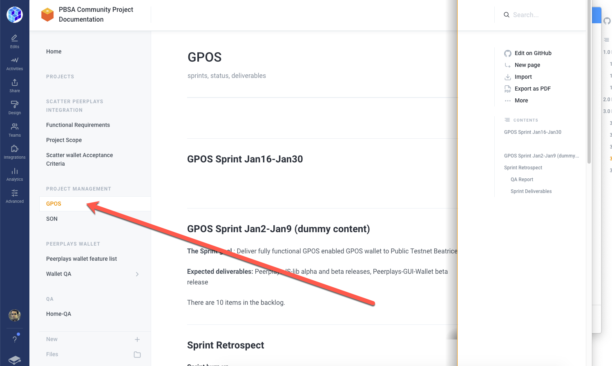

# Functional Requirements

## 1.0 Introduction

### 1.1 Objective

### 1.2 Scope

The scope is defined in the [project scope document](project-scope.md).

### 1.3 Assumptions and Constraints

This document will provide a tabular listing of the Peerplays Scatter Wallet Integration features. The target features for the Scatter Wallet Peerplays plugin will be based on this document. The features that Peerplays Scatter integration will provide is going to be a sub-set of the P[eerplays Wallet Features](https://app.gitbook.com/@peerplays/s/community-project-docs/peerplays-wallet/peerplays-wallet-feature-list).

## **2.0 High Level Requirements**

| Requirement | User Story |
| :--- | :--- |
| Connect to Peerplays blockchain | As a user I should be able to connect to the Peerplays main net. |
| Generate keypair | As a user I should be able to generate a Peerplays keypair. |
| Support for PPY asset | As a user I should have PPY asset support within the Scatter wallet. |
| Retrieve PPY Balance | As a user I should be able to see my PPY balance within the Scatter wallet. |
| Send PPY | As a user I should be able to send PPY via the Scatter wallet. |
| Receive PPY | As a user I should be able to receive PPY via the Scatter wallet. |

## 3.0 Functional Requirements

This section will provide detailed description, mockups/wireframes/screenshots of requirements provided in section 2. The Quality assurance team will prepare the test plan based on this section.

### 3.1 Connect to Peerplays blockchain:

### 3.2 Generate Keypair

### 3.3 Support for PPY Asset/Retrieve PPY Balance

### 3.4 Send PPY

### 3.5 Receive PPY

