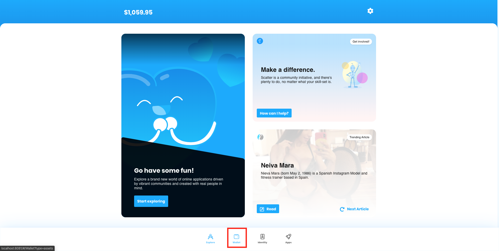
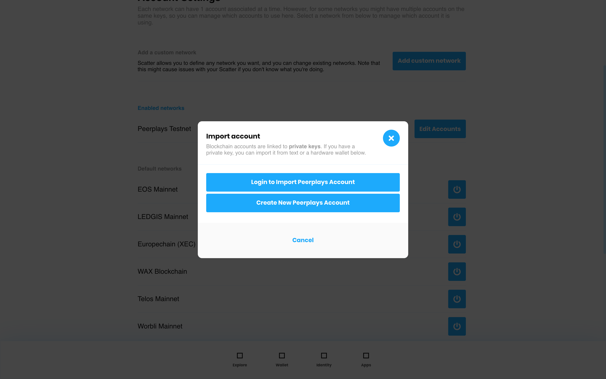

# Functional Requirements

## 1.0 Introduction

### 1.1 Objective

### 1.2 Scope

The scope of this document is to list the functional requirements for the Scatter Project.

This document will provide a tabular listing of the Peerplays Scatter Wallet Integration features. The target features for the Scatter Wallet Peerplays plugin will be based on this document. The features that Peerplays Scatter integration will provide is going to be a sub-set of the [Peerplays Wallet Features](https://app.gitbook.com/@peerplays/s/community-project-docs/peerplays-wallet/peerplays-wallet-feature-list).

The scope of the entire project defined in the [project scope document](project-scope.md).

### 1.3 Assumptions and Constraints

Assumptions:

* The production version of the application will be built with Electron.
* The production version of the application will use ScatterDesktop for encryption.
* Unless specified otherwise, all features/functions described in this document assume the end-user is logged into the Scatter application.

Constraints:

* The application will not run on outdated operating systems. Specific versions can be found in the acceptance criteria document.

## **2.0 High Level Requirements**

| Requirement | User Story |
| :--- | :--- |
| Connect to Peerplays blockchain | As a user I should be able to connect to the Peerplays main net. |
| Generate keypair | As a user I should be able to generate a Peerplays keypair. |
| Create Peerplays account | The user must be directed to a faucet to create the peerplays account |
| Import Peerplays Keys | A Given Peerplays private key should be imported by Scatter wallet |
| Support for PPY asset | As a user I should have PPY asset support within the Scatter wallet. |
| Retrieve PPY Balance | As a user I should be able to see my PPY balance within the Scatter wallet. |
| Send PPY | As a user I should be able to send PPY via the Scatter wallet. |
| Receive PPY | As a user I should be able to receive PPY via the Scatter wallet. |

## 3.0 Functional Requirements

This section will provide detailed description, mockups/wireframes/screenshots of requirements provided in section 2. The Quality assurance team will prepare the test plan based on this section.

### 3.1 Connect to Peerplays blockchain

A user should be able to "connect" to the Peerplays blockchain. This process is done automatically with no configuration steps required by the end user. If there are any issues with the network that a connection request is being made against, a UI error will appear as seen in Figure 3.1.4.

To view networks and their connectivity status, a user must login to the Scatter wallet and navigate to their account settings via the cogwheel icon in the top right of the UI.


On the next screen that shows, you want to navigate to the "Accounts" tab.


The next screen will display the networks you have on your Scatter account broken down into two sections: "Enabled networks" and "Default networks". The enabled networks area contains a list of blockchain networks that are enabled and of these, there will be connectivity tests run against. If connections succeed, the screen should contain no errors. If one or more of the networks fails to connect: red error text \("Connection error!"\) prefixed with a warning label as seen in Figure 3.1.4


### 3.2 Generate Keypair

The generate keypair option will generate a Public-Private Key pair and display under a group. The keypair generation itself doesn't mean any linking with the Peerplays blockchain. Once the keypair is created, a faucet can be used to create a Peerplays blockchain account with a unique user name \(NAI\). The username will be subject to the Peerplays account creation [guidelines](https://github.com/peerplays-network/peerplays/wiki/Account-Names).

To generate a Scatter keypair:

* Login to the Scatter application
* Navigate to the Settings screen
* Click on "Edit Accounts" in the Peerplays row \(Figure 3.2.1\)


* Click the + button in the top right of the modal that displays after clicking "Edit Accounts" \(Figure 3.2.2\)


* On the new screen that appears, click one of the two blue buttons to start the keypair generation process. Each button ties to an individual flow with their own section further down in this document: "Login to Import Peerplays Account": [Section 3.4](https://app.gitbook.com/@peerplays/s/community-project-docs/~/drafts/-M1aC-V3ASbUAMy9Wl1b/v/master/scatter-peerplays-integration/functional-requirements#3-4-import-peerplays-keys) "Create New Peerplays Account": [Section 3.3](https://app.gitbook.com/@peerplays/s/community-project-docs/v/master/scatter-peerplays-integration/functional-requirements#3-3-create-peerplays-account)


#### Details of how a Peerplays keypair is generated programmatically within Scatter:

Due to restrictions place upon the Scatter Keypair object that contains the private Wallet Import Format \(WIF\) and public key string, the Peerplays plugin cannot use typical keys. Reason number one for this is that the Peerplays blockchain operates with various authorization levels that are attached to various keys. 

As an example, user "login" on the Peerplays Core GUI wallet is done by comparing a client-side generated active public key with a blockchain retrieved active public key. However, there are instances where we need to also compare a public owner key due to an event where _some_ Peerplays accounts were created with their owner and active keys swapped.

As another example, to send a transfer of funds on the Peerplays blockchain, you are required to have both the active private key and the memo private key. 

To circumvent the requirement for multiple keys but only the ability to store one private key, and its public key counterpart, the Peerplays Scatter plugin will encode all three keys into a single new "master" key for exclusive use within Scatter. The result will be a Scatter Keypair with the following format:

```text
Keypair = {
  privateKey: 'encodedWifKeysHere`,
  publicKeys: [{
    key: 'activePublicKeyHere',
    blockchain: 'ppy'
  }]
}
```

`Keypair.privateKey` contains all three authority level keys in WIF for a Peerplays account \(owner, active, memo\) in an encoded format using "[little endian encoded Unicode characters](https://millermedeiros.github.io/mdoc/examples/node_api/doc/buffers.html)":`Buffer.from('stringtexthere').toString('ucs2')`

This encoding method essentially cuts the resulting string size in half. This format is required as the Scatter wallet will not encrypt the `Keypair.privateKey` if its length is greater than 100 characters.

`Keypair.publicKeys[0].key` is the active public key which is just a required item for a Scatter wallet Keypair object.

### 3.3 Create Peerplays Account

By default, a new Scatter user will not have any Peerplays accounts/keys associated with their Scatter account. In this use-case, the Scatter user either does not have a Peerplays account at all \(will need to make one\) or wishes to create a new one and then import the keys \([3.4](https://app.gitbook.com/@peerplays/s/community-project-docs/scatter-peerplays-integration/functional-requirements#3-4-import-peerplays-keys)\) into their Scatter account.

We will assume that the end-user has already created a Scatter account and is logged into their Scatter wallet with said account.


The first course of action to create a Peerplays account is to click the cog wheel icon in the top right of the ScatterBridge user interface \(UI\).


From the Scatter settings screen, the Scatter user must then click the "ACCOUNTS" tab header.


If the Peerplays section is greyed out, click the switch to enable Peerplays account\(s\). From this screen, the Scatter user will have to click "Edit Accounts" beside the blockchain they want to alter/add an account to: Peerplays in this case.



A new Scatter user account should see no keys here when they go to create a Peerplays account. From this screen, the Scatter user will have to click the plus icon blue button in the top right of the foremost visible window.



On the new modal that appears, we see the first **new** screen required to be added. This modal is based on the original but we show three buttons instead:

#### "Create New Peerplays Account"

![Figure 3.3.6: Create New Peerplays Account \[empty\]](../.gitbook/assets/image%20%282%29.png)

![Figure 3.3.7: Create New Peerplays Account \[filled - errors\]](../.gitbook/assets/image%20%286%29.png)

![Figure 3.3.8: Create New Peerplays Account \[filled\]](../.gitbook/assets/image%20%2815%29.png)

Peerplays account creation will have a similar process as it does on any other Peerplays dapp:

* username field
* code generated password read-only field
* password re-entry field
* download recovery file button
* form submit/create button

However, there are some rules and conditions to this form:

**Errors**

If any form component has an error, their appearance will change to match that of Figure 3.3.10.

**"Account Name" Field**

* string input field
* character limit of 52
* only lower-case characters
* username restrictions:
  * must start with a letter
  * must contain at least one dash, a number, or not contain any vowels

If an "error" occurs within this field, a red error text will appear below the field as seen in Figure 3.3.10 with the error text of:

* "Must start with a letter and contain at least one dash, a number, or no vowels"

**"Your account password is" Field**

* string input field
* read-only
* character limit of 52
* only lower-case alphanumeric characters
* can be highlighted and then copied to the end-users' clipboard
* computer generated using [randomstring](https://www.npmjs.com/package/randomstring) NPM package:
  * length: 52 characters
  * charset: alphanumeric

**"Re-enter generated password" Field**

* string input field
* character limit of 52
* only lower-case alphanumeric characters

If an "error" occurs within this field, a red error text will appear below the field as seen in Figure 3.3.10 with the error text of:

* "These passwords don't match"

**"Download Recovery File" Button**

Clicking this button will download a `.txt` file type that contains only one thing: the randomstring generated password in read-only format from the form. The "download" occurs via a "save file as" dialog window on the end-users' operating system that allows them to save the file \(and/or rename the file\) to a location of their choosing on their computer.

_more details coming_...

#### "Cancel" Button

No change in behaviour or appearance for this button. Clicking this button will close the modal.

**"Create" Button**

When one or more of the form input fields, excluding generated password, have some content in them; the "Cancel" button will turn into a form submit button.

Only when all form fields are error free will clicking the "Create" button have an effect.

Once the form has been submitted, the following actions occur programatically:

1. Generate Peerplays owner, active, and memo keys using form values: "account name" and "re-enter generated password" \(account name + password\)
2. Attach public keys generated to the registration request to be sent
3. Send request \(with public keys attached\) to a Peerplays faucet to handle creation of the account
4. If registration was successful, a response from the faucet will return the public keys for the account that was created on the Peerplays blockchain

Assuming step four has a positive result, the final step is to take the keys generated in step one and provide these generated keys to Scatter for storage.

### 3.4 Import Peerplays Keys


Importing Peerplays keys will have the same user flow from part 3.2 up till figure 3.3.5.


The following outline the flow of importing keys into a Scatter account if the end-user opted for the "Login to Import Peerplays Account" button route.

#### Login to Import Peerplays Account

![Figure 3.4.1: Login to Import Peerplays Account \[empty\]](../.gitbook/assets/image%20%285%29.png)

![Figure 3.4.2: Login to Import Peerplays Account \[filled - errors\]](../.gitbook/assets/image%20%287%29.png)

![Figure 3.4.3: Login to Import Peerplays Account \[filled\]](../.gitbook/assets/image%20%2841%29.png)

Peerplays account importing into Scatter will appear the end-user like any other Peerplays dapp login form:

* account name input field
* account password input field
* form submit/login button

**Errors**

If any form component has an error, their appearance will change to match that of Figure 3.4.2.

**"Account Name" Field**

* string input field
* character limit of 52
* only lower-case characters
* username restrictions:
  * must start with a letter
  * must contain at least one dash, a number, or not contain any vowels

If an "error" occurs within this field, a red error text will appear below the field as seen in Figure 3.4.2 with the error text of:

* "Must start with a letter and contain at least one dash, a number, or no vowels"

**"Password" Field**

* string input field
* character limit of 52
* only lower-case alphanumeric characters

If an "error" occurs within this field, a red error text will appear below the field as seen in Figure 3.4.2 with the error text of:

* "Password should be at least 22 symbols \(alphanumeric\)"

**"Cancel" Button**

No change in behaviour or appearance for this button. Clicking this button will close the modal.

**"Login" Button**

When one or more of the form input fields ****have some content in them; the "Cancel" button will turn into a form submit button.

Only when all form fields are error free will clicking the "Login" button have an effect.

Once the form has been submitted, account authorization for the user supplied account name will begin. Peerplays account authorization flow is as follows:

1. supply a Peerplays account name and its matching password
2. request from Peerplays blockchain for account object by account name provided by user
3. generate owner, active, an memo keys from user provided account name and password
4. compare generated active and/or owner key with the blockchain returned public keys
   1. some legacy accounts had their owner and active keys swapped at one point during their registration procedure so it is necessary to swap and check so these accounts retain login access
5. if a match is found, the account that the end-user tried to authorize is authorized.

During this process, we generate all of the keys required by Scatter. If after step five, the Peerplays account in question is authorized, we can then provide these generated keys to Scatter for storage.

### 3.5 Support for PPY Asset/Retrieve PPY Balance


### 3.6 Send PPY


### 3.7 Receive PPY


