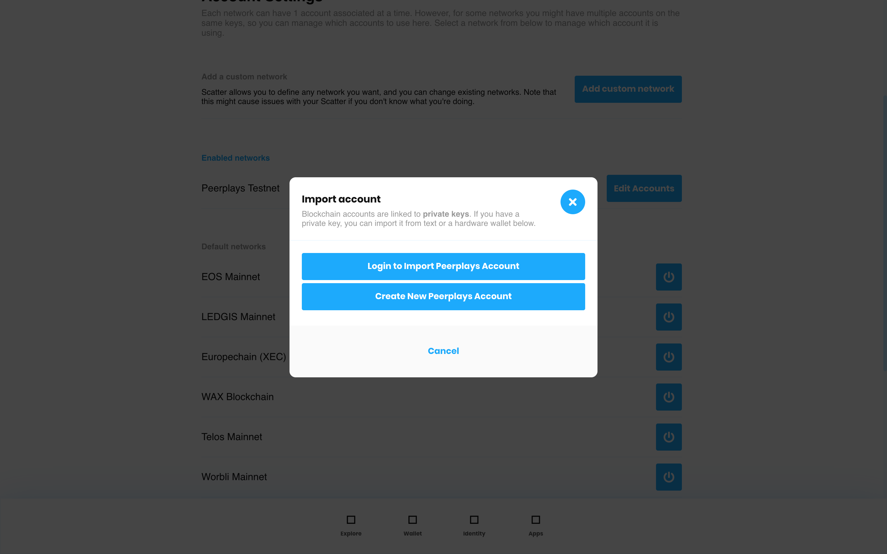

# Create Peerplays Account

By default, a new Scatter user will not have any Peerplays accounts/keys associated with their Scatter account. In this use-case, the Scatter user either does not have a Peerplays account at all \(will need to make one\) or wishes to create a new one and then import the keys \([3.4](https://app.gitbook.com/@peerplays/s/community-project-docs/scatter-peerplays-integration/functional-requirements#3-4-import-peerplays-keys)\) into their Scatter account.

To start the process of creating a Peerplays account, which results in its keys being imported into Scatter, perform the following steps:

* The first course of action to create a Peerplays account is to click the cog wheel icon in the top right of the ScatterBridge user interface \(UI\).

* From the Scatter settings screen, the Scatter user must then click the "ACCOUNTS" tab header

* If the Peerplays section is greyed out, click the switch to enable Peerplays account\(s\). From this screen, the Scatter user will have to click "Edit Accounts" beside the blockchain they want to alter/add an account to: Peerplays in this case.

* A new Scatter user account should see no keys here when they go to create a Peerplays account. From this screen, the Scatter user will have to click the plus \(+\) icon blue button in the top right of the foremost visible window.

* On the new modal that appears, select one of the two options and follow the subsequent section to perform that buttons associated user flow.
  * "Login to Import Peerplays Account": keep going in this section
  * "Create New Peerplays Account": skip to section 3.4

**"Create New Peerplays Account"**

After clicking "Create New Peerplays Account", you will see the modal just below \(Figure 3.3.6\).

1. Enter a username
   1. only lowercase alphanumeric and symbols should be able to be entered
2. copy the provided password into the "Re-enter generated password" field.
   1. You can click the "COPY" button to copy the password to your computers clipboard or manually copy it
3. Optionally download your password to a `.txt` file by clicking the "DOWNLOAD RECOVERY FILE".
4. Click "Create" at the bottom of the modal
   1. If you do not see "Create", then please check the error displays \(Figure 3.3.7\). They indicate errors within the form that must be resolved for you to be able to submit the form. A valid form will look like the one in Figure 3.3.8

![Figure 3.3.6: Create New Peerplays Account \[empty\]](../../.gitbook/assets/image%20%284%29.png)

![Figure 3.3.7: Create New Peerplays Account \[filled - errors\]](../../.gitbook/assets/image%20%289%29.png)

![Figure 3.3.8: Create New Peerplays Account \[filled\]](../../.gitbook/assets/image%20%2823%29.png)

Peerplays account creation will have a similar process as it does on any other Peerplays dapp:

* username fie \(Account Name\)
* code generated password read-only field \(Your account password is
* password re-entry field \(Re-enter generated password\)
* copy password button \(COPY\)
* download recovery file button \(DOWNLOAD RECOVERY FILE\)
* form submit/create button \(Create\)

However, there are some rules and conditions to this form:

**Errors**

If any form component has an error, their appearance will change to match that of Figure 3.3.10.

**"Account Name" Field**

* string input field
* character limit of 52
* only lower-case characters
* username restrictions:
  * must start with a letter
  * must contain at least one dash, a number, or not contain any vowels

If an "error" occurs within this field, a red error text will appear below the field as seen in Figure 3.3.10 with the error text of:

* "Must start with a letter and contain at least one dash, a number, or no vowels"

**"Your account password is" Field**

* string input field
* read-only
* character limit of 52
* only lower-case alphanumeric characters
* can be highlighted and then copied to the end-users' clipboard
* computer generated using [randomstring](https://www.npmjs.com/package/randomstring) NPM package:
  * length: 52 characters
  * charset: alphanumeric

**"Re-enter generated password" Field**

* string input field
* character limit of 52
* only lower-case alphanumeric characters

If an "error" occurs within this field, a red error text will appear below the field as seen in Figure 3.3.10 with the error text of:

* "These passwords don't match"

**"Download Recovery File" Button**

Clicking this button will download a `.txt` file type that contains only one thing: the randomstring generated password in read-only format from the form. The "download" occurs via a "save file as" dialog window on the end-users' operating system that allows them to save the file \(and/or rename the file\) to a location of their choosing on their computer.

_more details coming_...

#### "Cancel" Button

No change in behaviour or appearance for this button. Clicking this button will close the modal.

**"Create" Button**

When one or more of the form input fields, excluding generated password, have some content in them; the "Cancel" button will turn into a form submit button.

Only when all form fields are error free will clicking the "Create" button have an effect.

Once the form has been submitted, the following actions occur programatically:

1. Generate Peerplays owner, active, and memo keys using form values: "account name" and "re-enter generated password" \(account name + password\)
2. Attach public keys generated to the registration request to be sent
3. Send request \(with public keys attached\) to a Peerplays faucet to handle creation of the account
4. If registration was successful, a response from the faucet will return the public keys for the account that was created on the Peerplays blockchain

Assuming step four has a positive result, the final step is to take the keys generated in step one and provide these generated keys to Scatter for storage.

