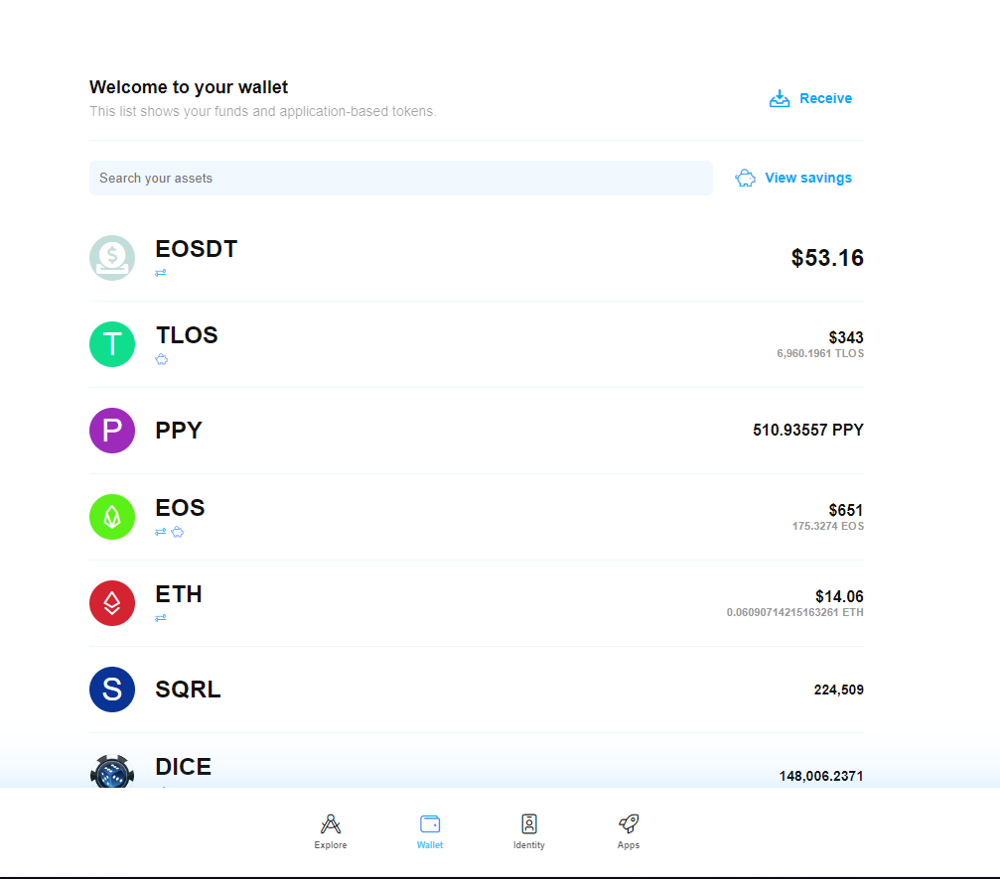
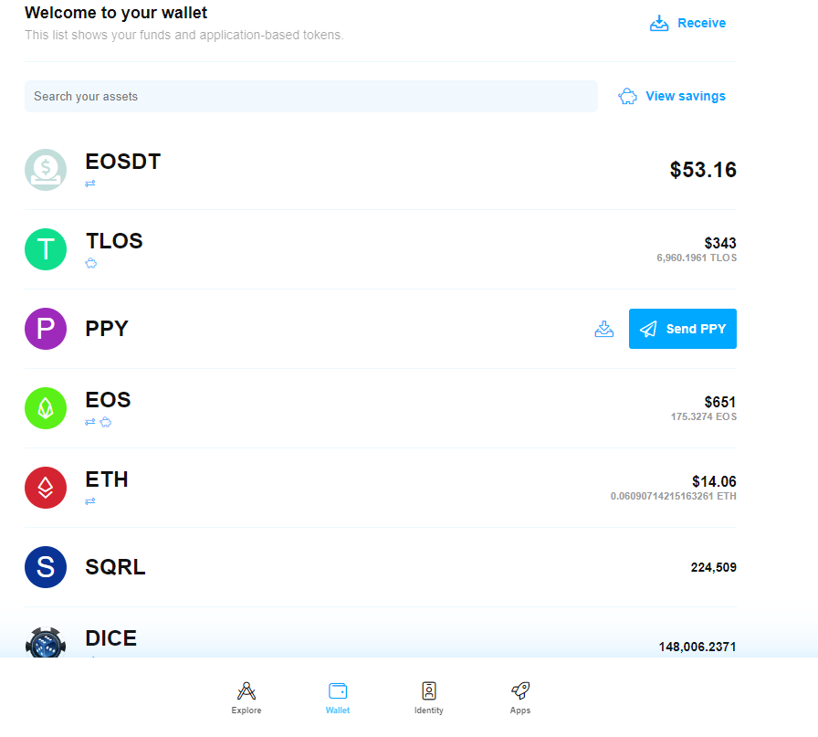

# Support for PPY Asset/Retreive PPY Balance

### 

Selecting the wallet button in the bottom bar will take you to the main wallet screen. Hovering over a token type will display receive and send icons.

After importing your Peerplays account or creating a new Peerplays account and selecting it, you should be able to retrieve your PPY balance on the wallet screen by selecting one of the two buttons.

