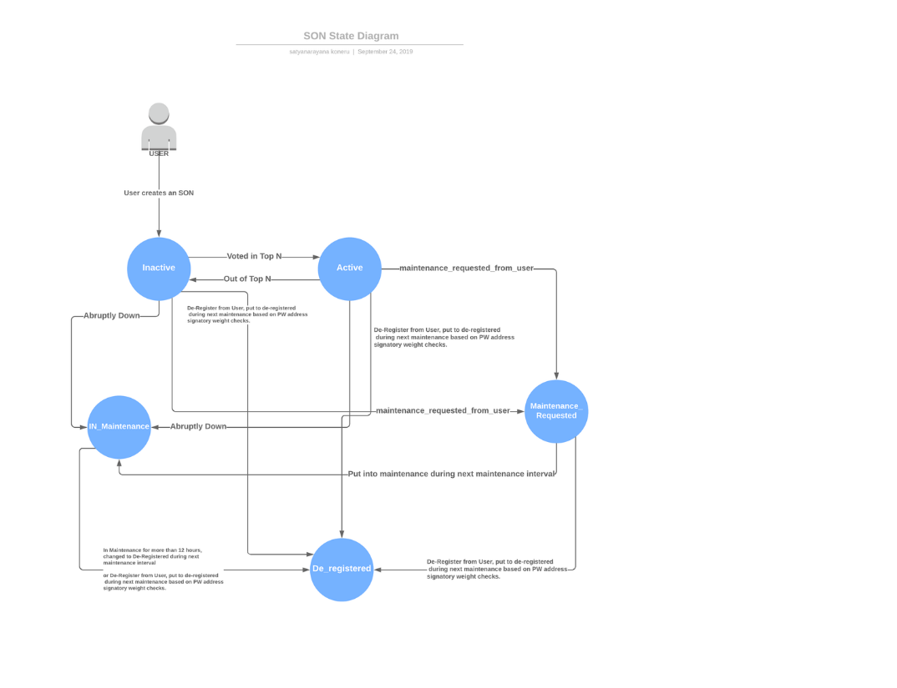
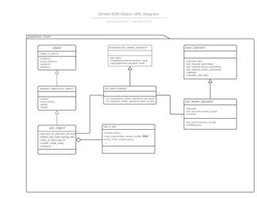
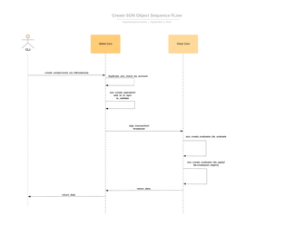
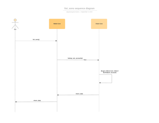
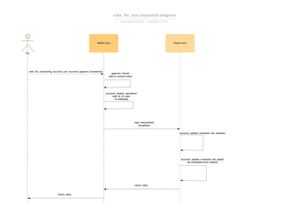
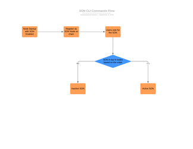

# SON Objects and Operators

## 1. Purpose

The purpose of this document is to provide low-level design for creating new SON objects, updating the objects, listing them once created and voting for them.

## 2. Scope

The design requirement listed in this document will be limited to the creation of the new SON objects, updating the objects, listing the objects on CLI and voting for the objects.

The document will also outline the new data structures required to create and update the objects/accounts on the blockchain through UML diagrams.

The document will also outline the related function flow between modules through Sequence diagrams.

The document will also outline the roles of the accounts/users operating the SONs.

## 3. Background

The Bitcoin Sidechain functionality has been implemented in the Peerplays blockchain but it doesn't take into account, the change of witnesses. As per the current implementation of Sidechain, a multi-sig bitcoin address will be created on the bitcoin blockchain to hold the bitcoins that have been deposited into the pBTC accounts of the Peerplays users. Every Peerplays witnesses will have a bitcoin transaction signing key for this multi-sig bitcoin address and will be required to sign any withdrawal transaction. When a witness changes, the transaction signing key of the outgoing witness needs to be removed from the multi-sig bitcoin address and the key of the incoming witness needs to be added. The suggested proposal is to make the Sidechain code available as a plugin and assign the responsibility for running the sidechain code to separate nodes called the Sidechain Operating Nodes \(SONs\). The SON functionality will be independent of the witness functionality and SONs don't need to be changed much often.

## 4. Disambiguation of types of users

This section tries to disambiguate the types of users registered on the current system and their roles.

### 4.1 Witness

Witnesses are the workhorses of the network.

The main task of the nodes is to gather the transactions, put them into a block, sign the block and broadcast it to network.

For each block produced by a witness, there is payment in core asset which is configured on the chain.

### 4.2 Workers

Workers are the group of users who maintain the network and introduce new features into the network.

### 4.3 Committee Members

Committee members are the unpaid volunteers that organize the community and propose changes to the network.

### 4.4 PPY Holders

PPY Holders are regular users who hold PPY in their accounts.

They can cast a vote and influence the decisions of the network.

### 4.5 SON Operators \(new\)

SON operators are the users that start a SON node on the network.

They can ask for votes from other users to be selected as top N SON operators. \(N is currently proposed to be 15\)

### 4.5.1 Roles and Requirements 

* These are the possible states for the new user role of SON,
  * **Active** SON - an account that is one of the top 15 voted SONs and is actively performing the operations of Sidechain.
  * **Inactive** SON - an account that is ready to perform the work required for Sidechain operation, but does not have the votes to be one of the top 15 votes SONs. An inactive SON can become active during a maintenance interval if it receives enough votes to become one of the top 15 voted SONs.
  * **Maintenance\_Requested** SON - An SON account has requested for Maintenance and waiting for the maintenance interval for its account to be updated to In\_Maintenance. [SON-214](https://peerplays.atlassian.net/browse/SON-214) Done
  * **In\_Maintenance** SON - An SON is in maintenance.
  * **De-Registered** SON - If an SON de-registers by itself through remove\_son command or goes down abruptly and stays down for 12 hours or in maintenance for 12 hours, it is de-registered. \(de-registered user will have to create the son node again using create\_son \)
* Prospective SON operator's accounts should have a minimum amount of core asset \(PPY\) that needs to be vested in order to join the SONs. \(50 PPY proposed currently\)
* SON Operator cannot reclaim the vested assets till after 2 days of deregistration of the node.

### 5. Design Changes Suggested

This section outlines the changes needed to realize the functionality of creation, update, and deletion of SON Nodes.

And it also outlines some of the Sequence diagrams of the use cases list\_sons, vote\_for\_son.

Following is a brief overview of new data structures introduced,

### 5.1 son\_object

This class holds all the information about SON and is stored in the DB.

son\_create\_operation creates the son object.

son\_update\_operation updates the son object.

son\_delete\_operation deletes the son object from DB.

### 5.2 son\_create\_operation

This class is used to create a son object in DB.

Whenever the SON creation is triggered this operation is pushed into a transaction.

It holds information like son\_account, public block signing key.

### 5.3 son\_update\_operation

This class is used to update an already created son object in DB.

### 5.4 son\_delete\_operation

This class is used to delete an already created son object in DB.

### 5.5 son\_create\_evaluator

This class contains do\_evaluate and do\_apply functions which evaluate and apply the create operation respectively.

do\_apply creates son\_object in DB.

### 5.6 son\_update\_evaluator

This class contains do\_evaluate and do\_apply functions which evaluate and apply the update operation respectively. 

do\_evaluate checks for the son\_object existence in DB.

do\_apply updates the son\_object with parameters supplied in son\_update\_operation.

### 5.7 son\_delete\_evaluator

This class contains do\_evaluate and do\_apply functions which evaluate and apply the update operation respectively. 

do\_evaluate checks for the son\_object existence in DB.

do\_apply deletes the son\_object with parameters supplied in son\_delete\_operation.

### 5.7 vote\_id\_type \(Enum\)

A new vote type _**son**_ is introduced which is needed in vote\_for\_son flow.

### 5.8 chain\_parameters

A new extension parameter in chain\_parameters **maximum\_son\_count** needs to be introduced with default value as 15 initially \(proposed currently\).

Later if the count has to be changed it can be done through _**committee\_member\_update\_global\_parameters\_operation**_.

### 6. UML and Sequence Diagrams

### 7. CLI Wallet Commands

Following are the CLI Wallet commands to realize the functionality shown above,

### 7.1 Node Startup with SON Enabled

| **./programs/witness\_node/witness\_node --resync --replay --son\_enable** | **The command enables the SON functionality in the node** |
| :--- | :--- |

### 7.2 Register as SON Node \(wallet\) 

| **create\_son &lt;account\_name&gt; &lt;proposal\_url&gt; true** | **The command registers the node on-chain and creates an ID** |
| :--- | :--- |

### 7.3 list\_sons \(wallet\)

| **list\_sons** | **The command lists all the account names that own SONs, active or inactive** |
| :--- | :--- |

### 7.4 vote\_for\_son \(wallet\)

| **vote\_for\_son &lt;voting\_account&gt; &lt;son\_account&gt; &lt;approve&gt; &lt;broadcast&gt;** | **The command allows voting in or out for a given SON account** |
| :--- | :--- |

### 7.5 update\_son \(wallet\)

| **update\_son &lt;son\_account&gt; &lt;proposal\_url&gt; &lt;signing\_key&gt; &lt;broadcast&gt;** | **The command updates the created SON Object related to the SON account given** |
| :--- | :--- |

### 7.6 remove\_son \(wallet\)

| **remove\_son &lt;son\_account&gt; &lt;broadcast&gt;** | **The command marks the SON Node as delete on-chain** |
| :--- | :--- |

